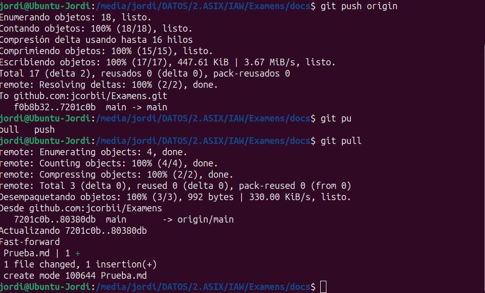

# Examen: Unidad 01  

### Módulo SXI

**Autor:** CORBÍ MICÓ, JORDI  
**Correo:** jorcormic@alu.edu.gva.es

# Entrega

## Comandos de Git

### Compartir y actualizar proyectos

| Comando  | Descripción |
|---------------|---------------|
| git push origin [nombre de la rama] | Envía una rama local al repositorio remoto |
| git push -u origin [nombre de la rama] | Envía cambios al repositorio remoto (y te posiciona en la rama concreta) |
| git push | Envía cambios al repositorio remoto (en la rama actual) |
| git push origin --delete [nombre de la rama] | Elimina una rama remota |
| git pull | Actualiza el repositorio local al último commit enviado |
| git pull origin [nombre de la rama] | Trae / agarra todos los cambios de un repositorio remoto |
| git remote add origin ssh://git@github.com/[nombreDeUsuario]/[nombre-del-repo].git | Añade cambios a un repositorio remoto |
| git remote set-url origin ssh://git@github.com/[nombreDeUsuario]/[nombre-del-repo].git | Ubica la rama remota de un repositorio remoto mediante su SSH|

