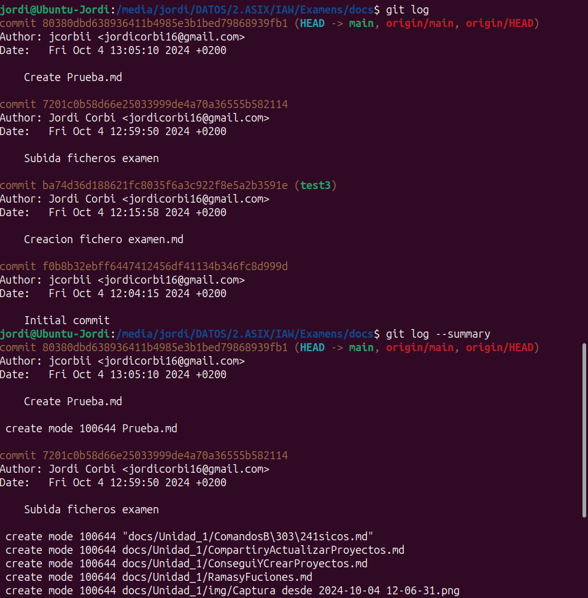

# Examen: Unidad 01  

### Módulo SXI

**Autor:** CORBÍ MICÓ, JORDI  
**Correo:** jorcormic@alu.edu.gva.es

# Entrega

## Comandos de Git

| Comando  | Descripción |
|---------------|---------------|
| git log | Visualiza los cambios |
| git log --summary | Visualiza los cambios (en detalle) |
| git log --oneline | Visualiza los cambios (resumido) |
| git diff [source branch] [target branch] | Vista previa de los cambios antes de hacer un merge |

